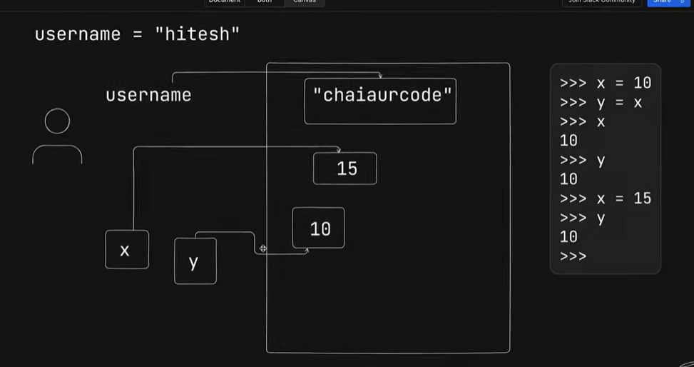

### **Technical Notes: Immutable and Mutable in Python**

This video explores the internal mechanics of how Python handles data in memory, specifically focusing on the often-misunderstood concepts of **mutability** and **immutability**. It clarifies that while a variable's reference can change, the underlying object in memory may be unchangeable.

---

### **1. The Core Concept: Everything is an Object**

In Python, every piece of data (strings, integers, floats, etc.) is treated as an **object**. When you assign a value to a variable, you are not just storing data in a box; you are creating an object in memory and making the variable name point (refer) to that object.

---

### **2. Mutability vs. Immutability**

The sources categorize common Python data types based on whether their content can be changed **in place** after they are created in memory.

- **Mutable (Can be changed):**
  - List
  - Set
  - Dictionary
  - Byte Array.
- **Immutable (Cannot be changed):**
  - Integer
  - Float
  - String
  - Tuple
  - Boolean.

---

### **3. Internal Working: Variable Reassignment**

A common point of confusion is why a "constant" or "immutable" string can seemingly be changed. The video explains that the **object** itself doesn't change; instead, the **reference** moves.

**Example: String Reassignment**

```python
username = "hitesh"
# Memory: A string object "hitesh" is created. 'username' points to it.

username = "chai aur code"
# Memory: A NEW string object "chai aur code" is created.
# 'username' now points to this new object.
# The original "hitesh" object remains unchanged until garbage collection.
```

In this scenario, the string "hitesh" was never modified to become "chai aur code." Python simply created a new object and updated the variable's pointer.

---

### **4. Internal Working: Shared References**

When multiple variables are assigned to the same value, they initially point to the same memory object.

**Example: Integer References**

```python
x = 10
y = x
# Both x and y point to the same integer object (10) in memory.

x = 15
# A new object (15) is created. x now points to 15.
# y still points to the original object (10).

print(x) # Returns 15
print(y) # Returns 10
```

This demonstrates that changing `x` does not affect `y` because the integer `10` is immutable; it cannot be modified to become `15`. Instead, a new memory allocation occurs for the new value.

---

### **5. Key Takeaways**

- **Memory References:** Mutability and immutability are about the memory reference, not just simple variable assignment.
- **In-Place Modification:** You cannot change a specific character within an immutable string (e.g., making a letter uppercase) "in place." You must provide a completely new string reference.
- **Garbage Collection:** When an object (like the old "hitesh" string) no longer has any variables pointing to it, Python’s automatic garbage collector eventually deletes it to free up memory.
  
